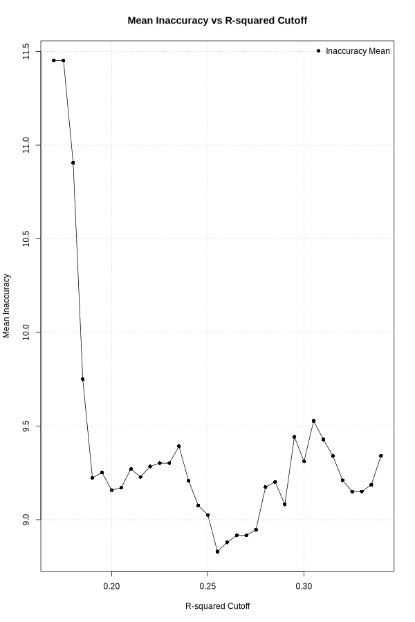

<!-- README.md is generated from README.Rmd. Please edit that file -->

```{r, include = FALSE}
knitr::opts_chunk$set(
  collapse = TRUE,
  comment = "#>",
  fig.path = "man/figures/README-",
  out.width = "100%",
  echo = TRUE,
  eval = FALSE
)
```

# PathPinpointR

<!-- badges: start -->

<!-- badges: end -->

The goal of PathPinpointR is to identify the position of a sample upon a trajectory.

### Limitations:

### Assumptions:

-   Sample is found upon the chosen trajectory.
-   Sample is from a distinct part of the trajectory. A sample with cells that are evenly distributed across the trajectory will have a predicted location of the centre of the trajectory.

# Example Workflow

#### This vignette will take you through running PPR.

##### The data used here is an integrated data-set of [blastocyst data](http://).

## Installation

You can install the development version of PathPinpointR using:

```{r}
library(devtools)
devtools::install_github("moi-taiga/PathPinPointR")
```

### Load necessary packages

```{r}
library(Seurat)
library(ggplot2)
library(SingleCellExperiment)
library(slingshot)
library(RColorBrewer)
library(GeneSwitches)
library(parallel)
```

### Here we use this Reprogramming data-set as the reference

```{r}
seu <- readRDS("./data/blastocyst_downsampled.rds")
```

#### View the reference UMAP

```{r}
DimPlot(object = seu,
        reduction = "umap",
        group.by = "orig.ident",
        label = TRUE) +
  ggtitle("Reference")
```
```{r, eval = TRUE}
knitr::include_graphics("/man/figures/README-reference-dimplot.png")
```

### We use subsets of the Reprogramming data-set as queries.
```{r}
## Take two subsets of the reference to use as samples
sample_names <- c("Petro16", "Tyser21")

# Make an empty list to store the samples
samples_seu <- list()
# Iterate through each sample name, make a list of subsets.
for (sample in sample_names){
  sample_seu <- subset(x = seu, subset = orig.ident %in% sample)
  samples_seu[[sample]] <- sample_seu
}
```

### Convert Seurat objects to SingleCellExperiment objects

```{r}
sce    <- SingleCellExperiment(assays = list(expdata = seu@assays$RNA$counts))
colData(sce) <- DataFrame(seu@meta.data)
reducedDims(sce)$UMAP <- seu@reductions$umap@cell.embeddings

# create an empty list to tstore the sce objects 
samples_sce <- list()

#
for (sample_name in names(samples_seu)){
  sample_seu <- samples_seu[[sample_name]]
  # convert each sample to a SingleCellExperiment object
  sample_sce <- SingleCellExperiment(assays = list(expdata = sample_seu@assays$RNA$counts))
  # Store the result in the new list
  samples_sce[[sample_name]] <- sample_sce
}
```

### Run slingshot on the reference data to produce a reprogramming trajectory.

```{r}
sce  <- slingshot(sce,
                  clusterLabels = "seurat_clusters",
                  start.clus  = "2",
                  end.clus = "1",
                  reducedDim = "UMAP")

#Rename the Pseudotime column to work with GeneSwitches
colData(sce)$Pseudotime <- sce$slingPseudotime_1
```

### Plot the slingshot trajectory.

```{r}
# Generate colors
colors <- colorRampPalette(brewer.pal(11, 'Spectral')[-6])(100)
plotcol <- colors[cut(sce$slingPseudotime_1, breaks = 100)]
# Plot the data
plot(reducedDims(sce)$UMAP, col = plotcol, pch = 16, asp = 1)
lines(SlingshotDataSet(sce), lwd = 2, col = 'black')
```

```{r, eval = TRUE}
knitr::include_graphics("/man/figures/README-slingshot.png")
```


## GeneSwitches
### Binarize
```{r, eval=FALSE}
# binarize the expression data of sce
sce           <- binarize_exp(sce,
                              fix_cutoff = TRUE,
                              binarize_cutoff = 0.1,
                              ncores = 8)

# Define a list to store the binarized samples
samples_binarized <- list()
# Iterate through each Seurat object in the list and binarize.
for (sample_name in names(samples_sce)){
  sample_sce <- samples_sce[[sample_name]]
  # binarize the expression data of the sample
  sample_binarized <- binarize_exp(sample_sce,
                                   fix_cutoff = TRUE,
                                   binarize_cutoff = 0.1,
                                   ncores = 64)
  # Store the result in the new list
  samples_binarized[[sample_name]] <- sample_binarized
}
# Find the swithcing point of each gene in the reference data
sce <- find_switch_logistic_fastglm(sce,
                                    downsample = FALSE,
                                    show_warning = FALSE)

```

# remove this chunk after testing
```{r, echo = FALSE}
samples_binarized <- list()
for (sample in sample_names){
  samples_binarized[[sample]] <- readRDS(paste0("./data/binarized_", sample, "_sce.rds"))
}
sce <- readRDS("./data/switches_gastglm_blastocyst_reference_sce.rds")
```

### Filter the reference to only include Switching Genes
```{r}
switching_genes <- filter_switchgenes(sce, allgenes = TRUE, r2cutoff = 0.257)
```

##### in order to find the optimum r2cutoff for the previosu command 
##### use the precision function or PathPinPointR
###### Start with a wide range and large steps,
###### then narrow down the range and decrease the step size.
```{r}
precision(sce, r2_cutoff_range = seq(0.17, 0.34, 0.005))
abline(v = 0.257, col = "blue")
```

```{r, eval = TRUE}

```

##### View all of the switching genes
```{r}
# Plot the timeline using plot_timeline_ggplot
plot_timeline_ggplot(switching_genes,
                     timedata = colData(sce)$Pseudotime,
                     txtsize = 3)

```

```{r, eval = TRUE}
knitr::include_graphics("/man/figures/README-switching-genes")
```

# Using PPR
### Reduce the binary counts matrices of the query data to only include the selection of switching genes.

```{r}
# filter the binary counts matricies to only include the switching genes
reference_reduced <- subset_switching_genes(sce, switching_genes)

# Define a list to store the results
samples_reduced <- list()

# Iterate through each Seurat object in the list
for (sample_name in names(samples_binarized)){
  sample_binarized <- samples_binarized[[sample_name]]
  # susbet each sample to only include the switching genes
  sample_reduced <- subset_switching_genes(sample_binarized, switching_genes)
  # Store the result in the new list
  samples_reduced[[sample_name]] <- sample_reduced
}

```

### Produce an estimate for the position on trajectory of each gene in each cell of a sample.

```{r}
reference_ppr    <- predict_position(reference_reduced, switching_genes)

# Define a list to store the ppr objects of the samples
samples_ppr <- list()
# Iterate through each Seurat object in the predicting their positons,
# on the reference trajectory, using PathPinpointR
for (sample_name in names(samples_reduced)){
  sample_reduced <- samples_reduced[[sample_name]]
  # predict the position of each gene in each cell of the sample
  sample_ppr <- predict_position(sample_reduced, switching_genes)
  #calculate zscore
  sample_ppr <- zscore(sce = samples_reduced[[sample_name]],
                       ppr = sample_ppr,
                       switching_genes,
                       cpu = 4)
  # Store the result in the new list
  samples_ppr[[sample_name]] <- sample_ppr
}
```

### Accuracy

#### *As our samples are subsets of the reference data-set we can calculate the accuracy of ppr*

#### *the accuracy varies across the range of pseudotimes*

```{r}
accuracy_test(reference_ppr, sce, plot = TRUE)
```

```{r, eval = TRUE}
knitr::include_graphics("/man/figures/README-accuracy_plot.png")
```

## Plotting

### Plot the predicted position of each sample:

#### *Optional: include the switching point of some genes of interest:*

```{r}

# Set up the PNG device
png(filename = "./man/figures/README-sample1.png", width = 600, height = 900)


plot_position(samples_ppr[[1]],
              col = "darkgreen",
              overlay = FALSE,
              label = names(samples_ppr)[1])

dev.off()
```

```{r}
knitr::include_graphics("./man/figures/README-sample1.png")
```

```{r}
plot_position(samples_ppr[[2]],
              col = "blue",
              overlay = FALSE,
              label = names(samples_ppr)[2])

```

```{r}
knitr::include_graphics("./man/figures/README-sample2.png")
```
