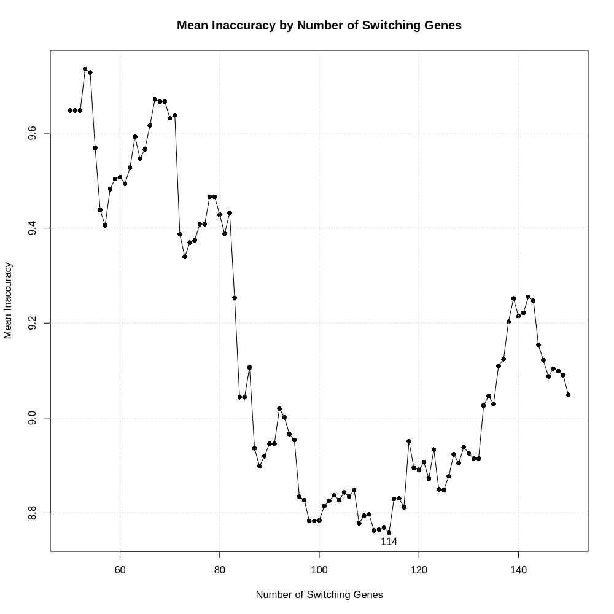

<!-- README.md is generated from README.Rmd. Please edit that file -->

```{r, include = FALSE}
knitr::opts_chunk$set(
  collapse = TRUE,
  comment = "#>",
  fig.path = "man/figures/README-",
  out.width = "100%",
  echo = TRUE,
  eval = FALSE
)
```

# PathPinpointR

<!-- badges: start -->

<!-- badges: end -->

PathPinpointR identifies the position of a sample upon a trajectory.

##### *Assumptions:*
-   Sample is found upon the chosen trajectory.
-   Sample is from a distinct part of the trajectory. A sample with cells that are evenly distributed across the trajectory will have a predicted location at the centre of the trajectory.


# Example Workflow

This vignette will take you through the basics running PPR.
The data used here is an integrated data-set of blastocyst data.

## Installation

#### Install required packages
Run the following code to load all packages neccecary for PPR & this vignette.
```{r}
required_packages <- c("SingleCellExperiment", "Biobase", "fastglm", "ggplot2",
                       "monocle", "plyr", "RColorBrewer", "ggrepel", "ggridges",
                       "gridExtra", "devtools", "mixtools", "Seurat",
                       "parallel", "RColorBrewer")

## for packages "fastglm", "ggplot2", "plyr", "RColorBrewer",
# "ggrepel", "ggridges", "gridExtra", "mixtools"
new_packages <- required_packages[!(required_packages %in% installed.packages()[,"Package"])]
if(length(new_packages)) install.packages(new_packages)

## for packages "SingleCellExperiment", "Biobase", "slingshot".
if (!requireNamespace("BiocManager", quietly = TRUE)) install.packages("BiocManager")
new_packages <- required_packages[!(required_packages %in% installed.packages()[,"Package"])]
if(length(new_packages)) BiocManager::install(new_packages)

# for package "GeneSwitches"
devtools::install_github("SGDDNB/GeneSwitches")
```


#### install PathPinpointR
You can install the development version of PathPinpointR using:
```{r}
devtools::install_github("moi-taiga/PathPinpointR")
```

### Load the required packages
```{r}
library(PathPinpointR)
library(Seurat)
library(ggplot2)
library(SingleCellExperiment)
library(slingshot)
library(RColorBrewer)
library(GeneSwitches)
```

## Load the reference data
The reference dataset is a Seurat object of a blastocyst dataset.
The data is an integrated dataset of 8 studies.
The data has been downsampled and filtered to only inlcude ebiblast cells.
```{r}
# download the example data
get_example_data()

# Load the reference data to the environment
reference_seu <- readRDS("./reference.rds")
# Load the sample data to the environment
samples_seu <- lapply(c("./LW120.rds", "./LW122.rds"), readRDS)
# name the samples in the list
names(samples_seu) <- c("LW120", "LW122")
```

#### View the reference UMAP plot
Plot the reference data, colored by the day of development.
```{r}
DimPlot(object = reference_seu,
        reduction = "umap",
        group.by = "time",
        label = TRUE) +
  ggtitle("Reference")
```
```{r, eval = TRUE, echo = FALSE}
knitr::include_graphics("./man/figures/README-reference-dim-plot.png")
```
The plot shows the development of the epiblast cells.
Some labels are a mix of samples from different days.

## Convert to SingleCellExperiment objects.
Prior to running slingshot and GeneSwitches, 
we need to convert the Seurat objects to SingleCellExperiment objects.
```{r}
reference_sce    <- SingleCellExperiment(assays = list(expdata = reference_seu@assays$RNA$counts))
colData(reference_sce) <- DataFrame(reference_seu@meta.data)
reducedDims(reference_sce)$UMAP <- reference_seu@reductions$umap@cell.embeddings

# create an empty list to to store the sce sample objects
samples_sce <- list()
# Iterate through each Seurat object in the samples list
for (i in seq_along(samples_seu)){
  # convert each sample to a SingleCellExperiment object & store in the list
  samples_sce[[i]] <- SingleCellExperiment(assays = list(expdata = samples_seu[[i]]@assays$RNA$counts))
}
# carry over the sample names from the Seurat objects.
names(samples_sce) <- names(samples_seu)
```

## Run slingshot 
Run slingshot on the reference data to produce pseudotime for each cell.
```{r}
reference_sce  <- slingshot(reference_sce,
                            clusterLabels = "seurat_clusters",
                            start.clus  = "2",
                            end.clus = "1",
                            reducedDim = "UMAP")

#Rename the Pseudotime column to work with GeneSwitches
colData(reference_sce)$Pseudotime <- reference_sce$slingPseudotime_1
```

#### Plot the slingshot trajectory.
The plot shows the trajectory of the blastocyst data,
with cells colored by pseudotime.
```{r}
# Generate colors
colors <- colorRampPalette(brewer.pal(11, "Spectral")[-6])(100)
plotcol <- colors[cut(reference_sce$slingPseudotime_1, breaks = 100)]
# Plot the data
plot(reducedDims(reference_sce)$UMAP, col = plotcol, pch = 16, asp = 1)
lines(SlingshotDataSet(reference_sce), lwd = 2, col = "black")
```

```{r, eval = TRUE, echo = FALSE}
knitr::include_graphics("./man/figures/README-slingshot.png")
```


## Binarize the Gene Expression Data
Using the package [GeneSwitches](https://github.com/SGDDNB/GeneSwitches),
binarize the gene expression data of the reference and query data-sets,
with a cutoff of 1.
```{r, eval=FALSE}
# binarize the expression data of the reference
reference_sce <- binarize_exp(reference_sce,
                              fix_cutoff = TRUE,
                              binarize_cutoff = 1,
                              ncores = 1)

# Find the switching point of each gene in the reference data
reference_sce <- find_switch_logistic_fastglm(reference_sce,
                                              downsample = TRUE,
                                              show_warning = FALSE)
```
Note: both binatize_exp() and find_switch_logistic_fastglm(),
are time consuming processes and may take tens of minutes to run.

## Visualise the switching genes
generate a list of switching genes, and visualise them on a pseudo timeline.
```{r}
switching_genes <- filter_switchgenes(reference_sce,
                                      allgenes = TRUE,
                                      r2cutoff = 0)

# Plot the timeline using plot_timeline_ggplot
plot_timeline_ggplot(switching_genes,
                     timedata = colData(reference_sce)$Pseudotime,
                     txtsize = 3)
```

```{r, eval = TRUE, echo = FALSE}

```

## Select a number of switching genes
Using the PPR function precision():
```{r}
precision(reference_sce)
```

```{r, eval = TRUE, echo = FALSE}
knitr::include_graphics("./man/figures/README-precision1_plot.png")
```

Narrow down the search to find the optimum number of switching genes.
```{r}
precision(reference_sce, n_sg_range = seq(50, 150, 1))
```

```{r, eval = TRUE, echo = FALSE}

```

## Filter and re-visualise the switching genes.
```{r}
switching_genes <- filter_switchgenes(reference_sce,
                                      allgenes = TRUE,
                                      r2cutoff = 0,
                                      topnum = 114)
```
Note: The number of switching genes significantly affects the accuracy of PPR.\
  too many will reduce the accuracy by including uninformative genes/noise. \
  too few will reduce the accuracy by excluding informative genes. \
The using precision(), 114 is found to be the optimum for this data. \
```{r}
# Plot the timeline using plot_timeline_ggplot
plot_timeline_ggplot(switching_genes,
                     timedata = colData(reference_sce)$Pseudotime,
                     txtsize = 3)
```

```{r, eval = TRUE, echo = FALSE}

```

## Binarize the sample data
Binarize the gene expression data of the samples.
```{r}
# First reduce the sample data to only include the switching genes.
samples_sce <- lapply(samples_sce, reduce_counts_matrix, switching_genes)

# binarize the expression data of the samples
samples_binarized <- lapply(samples_sce,
                            binarize_exp,
                            fix_cutoff = TRUE,
                            binarize_cutoff = 1,
                            ncores = 1)
```

## Predict Position
Produce an estimate for the position of each cell in each sample.
The prediction is stored as a PPR_OBJECT.
```{r}
reference_ppr <- predict_position(reference_sce, switching_genes)

# Iterate through each Seurat object in the predicting their positons,
# on the reference trajectory, using PathPinpointR.
samples_ppr <- lapply(samples_binarized, predict_position, switching_genes)
```

## Measure accuracy
We can calculate the accuracy of PPR in the given trajectory by comparing the 
predicted position of the reference cells to their pseudotimes defined by slingshot.

```{r}
accuracy_test(reference_ppr, reference_sce, plot = TRUE)
```

```{r, eval = TRUE, echo = FALSE}
knitr::include_graphics("./man/figures/README-accuracy_plot.png")
```


## Plotting the predicted position of each sample:
plot the predicted position of each sample on the reference trajectory.
```{r}
# show the predicted position of the first sample
# include the position of cells in the reference data, by a given label.
ppr_plot() +
  reference_idents(reference_sce, "time") +
  sample_prediction(samples_ppr[[1]], label = "Sample 1", col = "red")

# show the predicted position of the second sample
sample_prediction(samples_ppr[[2]], label = "Sample 2", col = "blue")

# show the points at which selected genes switch.
switching_times(c("TKTL1", "CYYR1", "KHDC1L"), switching_genes)
```

```{r eval = TRUE, echo = FALSE}
knitr::include_graphics("./man/figures/README-sample1.png")
```
