<!-- README.md is generated from README.Rmd. Please edit that file -->

# PathPinPointR

<!-- badges: start -->
<!-- badges: end -->

The goal of PathPinpointR is to identify the position of a sample upon a
trajectory.

### Limitations:

### Assumptions:

- Sample is found upon the chosen trajectory.
- Sample is from a distinct part of the trajectory. A sample with cells
  that are evenly distributed across the trajectory will have a
  predicted location of the centre of the trajectory.

# Example Workflow

#### This vignette will take you through running PPR. 

##### The data used here is an intregrated data-set of [blastocyst data](http://). 

## Installation

You can install the development version of PathPinpointR using:

``` r
# install.packages("devtools")
devtools::install_github("moi-taiga/PathPinPointR")
#> Using GitHub PAT from the git credential store.
#> Skipping install of 'PathPinpointR' from a github remote, the SHA1 (feff8443) has not changed since last install.
#>   Use `force = TRUE` to force installation
```

### Load neccecary packages

``` r
library(Seurat)
#> Loading required package: SeuratObject
#> Loading required package: sp
#> 'SeuratObject' was built under R 4.3.2 but the current version is
#> 4.3.3; it is recomended that you reinstall 'SeuratObject' as the ABI
#> for R may have changed
#> 'SeuratObject' was built with package 'Matrix' 1.6.4 but the current
#> version is 1.6.5; it is recomended that you reinstall 'SeuratObject' as
#> the ABI for 'Matrix' may have changed
#> 
#> Attaching package: 'SeuratObject'
#> The following object is masked from 'package:base':
#> 
#>     intersect
library(ggplot2)
library(SingleCellExperiment)
#> Loading required package: SummarizedExperiment
#> Loading required package: MatrixGenerics
#> Loading required package: matrixStats
#> 
#> Attaching package: 'MatrixGenerics'
#> The following objects are masked from 'package:matrixStats':
#> 
#>     colAlls, colAnyNAs, colAnys, colAvgsPerRowSet, colCollapse,
#>     colCounts, colCummaxs, colCummins, colCumprods, colCumsums,
#>     colDiffs, colIQRDiffs, colIQRs, colLogSumExps, colMadDiffs,
#>     colMads, colMaxs, colMeans2, colMedians, colMins, colOrderStats,
#>     colProds, colQuantiles, colRanges, colRanks, colSdDiffs, colSds,
#>     colSums2, colTabulates, colVarDiffs, colVars, colWeightedMads,
#>     colWeightedMeans, colWeightedMedians, colWeightedSds,
#>     colWeightedVars, rowAlls, rowAnyNAs, rowAnys, rowAvgsPerColSet,
#>     rowCollapse, rowCounts, rowCummaxs, rowCummins, rowCumprods,
#>     rowCumsums, rowDiffs, rowIQRDiffs, rowIQRs, rowLogSumExps,
#>     rowMadDiffs, rowMads, rowMaxs, rowMeans2, rowMedians, rowMins,
#>     rowOrderStats, rowProds, rowQuantiles, rowRanges, rowRanks,
#>     rowSdDiffs, rowSds, rowSums2, rowTabulates, rowVarDiffs, rowVars,
#>     rowWeightedMads, rowWeightedMeans, rowWeightedMedians,
#>     rowWeightedSds, rowWeightedVars
#> Loading required package: GenomicRanges
#> Loading required package: stats4
#> Loading required package: BiocGenerics
#> 
#> Attaching package: 'BiocGenerics'
#> The following object is masked from 'package:SeuratObject':
#> 
#>     intersect
#> The following objects are masked from 'package:stats':
#> 
#>     IQR, mad, sd, var, xtabs
#> The following objects are masked from 'package:base':
#> 
#>     anyDuplicated, aperm, append, as.data.frame, basename, cbind,
#>     colnames, dirname, do.call, duplicated, eval, evalq, Filter, Find,
#>     get, grep, grepl, intersect, is.unsorted, lapply, Map, mapply,
#>     match, mget, order, paste, pmax, pmax.int, pmin, pmin.int,
#>     Position, rank, rbind, Reduce, rownames, sapply, setdiff, sort,
#>     table, tapply, union, unique, unsplit, which.max, which.min
#> Loading required package: S4Vectors
#> 
#> Attaching package: 'S4Vectors'
#> The following object is masked from 'package:utils':
#> 
#>     findMatches
#> The following objects are masked from 'package:base':
#> 
#>     expand.grid, I, unname
#> Loading required package: IRanges
#> 
#> Attaching package: 'IRanges'
#> The following object is masked from 'package:sp':
#> 
#>     %over%
#> The following object is masked from 'package:grDevices':
#> 
#>     windows
#> Loading required package: GenomeInfoDb
#> Loading required package: Biobase
#> Welcome to Bioconductor
#> 
#>     Vignettes contain introductory material; view with
#>     'browseVignettes()'. To cite Bioconductor, see
#>     'citation("Biobase")', and for packages 'citation("pkgname")'.
#> 
#> Attaching package: 'Biobase'
#> The following object is masked from 'package:MatrixGenerics':
#> 
#>     rowMedians
#> The following objects are masked from 'package:matrixStats':
#> 
#>     anyMissing, rowMedians
#> 
#> Attaching package: 'SummarizedExperiment'
#> The following object is masked from 'package:Seurat':
#> 
#>     Assays
#> The following object is masked from 'package:SeuratObject':
#> 
#>     Assays
library(slingshot)
#> Loading required package: princurve
#> Loading required package: TrajectoryUtils
library(RColorBrewer)
library(GeneSwitches)
#> Welcome to GeneSwitches!
library(parallel)
library(devtools)
#> Loading required package: usethis
devtools::load_all()
#> ℹ Loading PathPinpointR
#> Welcome to PathPinpointR!
```

### Here we use this Reprogramming dataset as the reference

``` r
seu <- readRDS("./data/blastocyst_downsampled.rds")
```

#### View the reference UMAP

``` r
DimPlot(object = seu,
        reduction = "umap",
        group.by = "orig.ident",
        label = TRUE) +
  ggtitle("Reference")
```

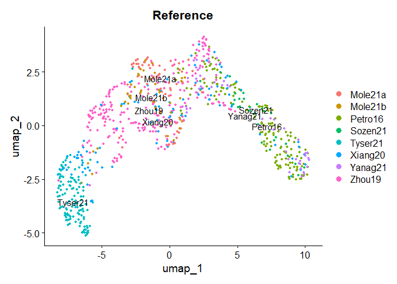

### We use subsets of the Reprogramming dataset as queries.

``` r
## Take two subsets of the reference to use as samples
sample_names <- c("Petro16","Tyser21")

# Make an empty list to store the samples
samples_seu <- list()
# Iterate through each sample name, make a list of subsets.
for (sample in sample_names){
  sample_seu <- subset(x = seu, subset = orig.ident %in% sample)
  samples_seu[[sample]] <- sample_seu
}
```

### Convert seurat objects to SingleCellExperiment objects

``` r
sce    <- SingleCellExperiment(assays = list(expdata = seu@assays$RNA$counts))
colData(sce) <- DataFrame(seu@meta.data)
reducedDims(sce)$UMAP <- seu@reductions$umap@cell.embeddings

# create an empty list to tstore the sce objects 
samples_sce <- list()

#
for (sample_name in names(samples_seu)){
  sample_seu <- samples_seu[[sample_name]]
  # convert each sample to a SingleCellExperiment object
  sample_sce <- SingleCellExperiment(assays = list(expdata = sample_seu@assays$RNA$counts))
  # Store the result in the new list
  samples_sce[[sample_name]] <- sample_sce
}
```

### Run slingshot on the reference data to produce a reprogramming trajectory.

``` r
sce  <- slingshot(sce,
                  clusterLabels = "seurat_clusters",
                  start.clus  = "2",
                  end.clus = "1",
                  reducedDim = "UMAP")

#Rename the Pseudotime column to work with GeneSwitches
colData(sce)$Pseudotime <- sce$slingPseudotime_1
```

### Plot the slingshot trajectory.

``` r
# Generate colors
colors <- colorRampPalette(brewer.pal(11, 'Spectral')[-6])(100)
plotcol <- colors[cut(sce$slingPseudotime_1, breaks = 100)]
# Plot the data
plot(reducedDims(sce)$UMAP, col = plotcol, pch = 16, asp = 1)
lines(SlingshotDataSet(sce), lwd = 2, col = 'black')
```

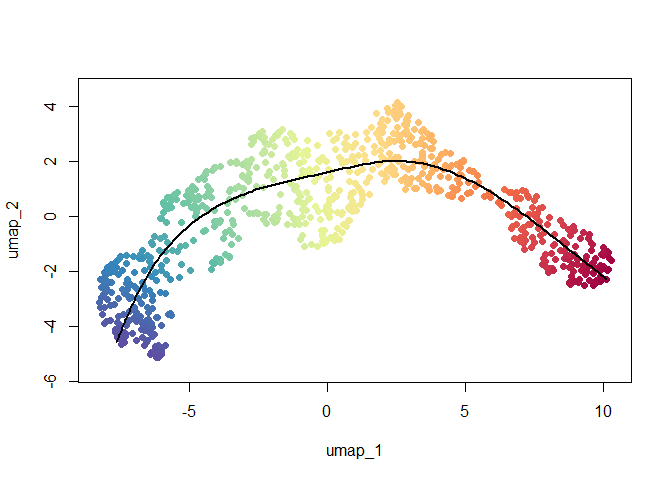

## GeneSwitches

### Choose a Binerization cutoff

``` r
trimmed_expdata <- assays(sce)$expdata[assays(sce)$expdata < 10]
hist(as.matrix(trimmed_expdata))
abline(v= 0.1, col = "blue")
```

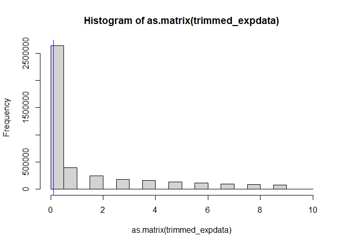

``` r

# cutoff = 1
```

### Binarize

``` r
# binarize the expression data of sce
sce           <- binarize_exp(sce,
                              fix_cutoff = TRUE,
                              binarize_cutoff = 1,
                              ncores = 8)

# Define a list to store the binarized samples
samples_binarized <- list()
# Iterate through each Seurat object in the list and binarize.
for (sample_name in names(samples_sce)){
  sample_sce <- samples_sce[[sample_name]]
  # binarize the expression data of the sample
  sample_binarized <- binarize_exp(sample_sce,
                                   fix_cutoff = TRUE,
                                   binarize_cutoff = 0.1,
                                   ncores = 64)
  # Store the result in the new list
  samples_binarized[[sample_name]] <- sample_binarized
}
# Find the swithcing point of each gene in the reference data
sce <- find_switch_logistic_fastglm(sce,
                                    downsample = FALSE,
                                    show_warning = FALSE)

# save the binarized data
# saveRDS(sce, file = "/mainfs/ddnb/PathPinpointR/package/PathPinpointR/data/switches_gastglm_blastocyst_reference_sce.rds")
# for (sample in sample_names) {
#   saveRDS(samples_binarized[[sample]], file = paste0("/mainfs/ddnb/PathPinpointR/package/PathPinpointR/data/binarized_", sample, "_sce.rds"))
# }
```

### Filter the reference to only include Switching Genes

``` r
switching_genes <- filter_switchgenes(sce, allgenes = TRUE, r2cutoff = 0.257)
```

##### View all of the switching genes

``` r
# Plot the timeline using plot_timeline_ggplot
plot_timeline_ggplot(switching_genes,
                     timedata = colData(sce)$Pseudotime,
                     txtsize = 3)
#> Warning in grid.Call(C_stringMetric, as.graphicsAnnot(x$label)): font family
#> not found in Windows font database

#> Warning in grid.Call(C_stringMetric, as.graphicsAnnot(x$label)): font family
#> not found in Windows font database
#> Warning in grid.Call(C_textBounds, as.graphicsAnnot(x$label), x$x, x$y, : font
#> family not found in Windows font database

#> Warning in grid.Call(C_textBounds, as.graphicsAnnot(x$label), x$x, x$y, : font
#> family not found in Windows font database
#> Warning: ggrepel: 46 unlabeled data points (too many overlaps). Consider
#> increasing max.overlaps
#> Warning in grid.Call.graphics(C_text, as.graphicsAnnot(x$label), x$x, x$y, :
#> font family not found in Windows font database

#> Warning in grid.Call.graphics(C_text, as.graphicsAnnot(x$label), x$x, x$y, :
#> font family not found in Windows font database

#> Warning in grid.Call.graphics(C_text, as.graphicsAnnot(x$label), x$x, x$y, :
#> font family not found in Windows font database

#> Warning in grid.Call.graphics(C_text, as.graphicsAnnot(x$label), x$x, x$y, :
#> font family not found in Windows font database
```

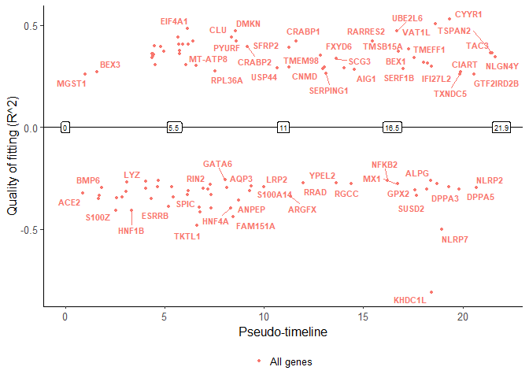

# Using PPR

##### View the selected switching genes

``` r
timeline_plot(switching_genes)
```

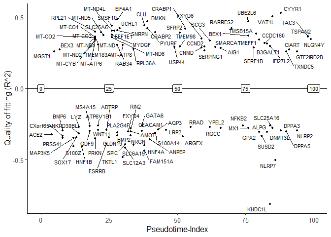

### Reduce the binary counts matricies of the query data to only include the selection os switching genes.

``` r
# filter the binary counts matricies to only include the switching genes
reference_reduced <- subset_switching_genes(sce, switching_genes)
#Mole21a_reduced   <- subset_switching_genes(sample_Mole21a_binarized, switching_genes)

# Define a list to store the results
samples_reduced <- list()

# Iterate through each Seurat object in the list
for (sample_name in names(samples_binarized)){
  sample_binarized <- samples_binarized[[sample_name]]
  # susbet each sample to only include the switching genes
  sample_reduced <- subset_switching_genes(sample_binarized, switching_genes)
   # Store the result in the new list
  samples_reduced[[sample_name]] <- sample_reduced
}
```

### Produce an estimate for the position on trajectory of each gene in each cell of a sample.

``` r
reference_ppr    <- predict_position(reference_reduced, switching_genes)

# Define a list to store the ppr objects of the samples
samples_ppr <- list()
# Iterate through each Seurat object in the predicting their positons,
# on the reference trajectory, using PathPinpointR
for (sample_name in names(samples_reduced)){
  sample_reduced <- samples_reduced[[sample_name]]
  # predict the position of each gene in each cell of the sample
  sample_ppr <- predict_position(sample_reduced, switching_genes)
  #calculate zscore
  sample_ppr <- zscore(sce = samples_reduced[[sample_name]],
                       ppr = sample_ppr,
                       switching_genes,
                       cpu = 4)
  # Store the result in the new list
  samples_ppr[[sample_name]] <- sample_ppr
}
```

### Accuracy

#### *As our samples are subsets of the reference dataset we can calculate the accuracy of ppr*

#### *the accuracy varies accross the range of pseudptimes*

``` r
accuracy_test(reference_ppr, sce, plot = TRUE)
```

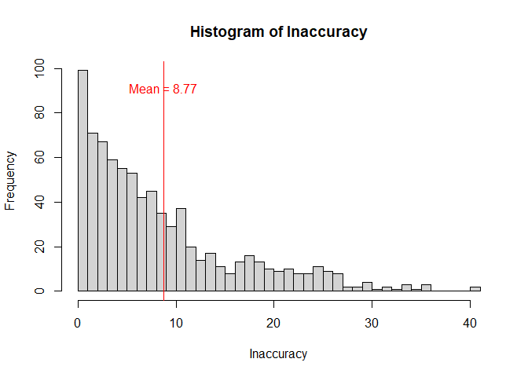

## Plotting

### Plot the predicted position of each sample:

#### *Optional: include the switching point of some genes of interest:*

``` r
plot_position(reference_ppr,
              col = "red",
              overlay = FALSE,
              label = "Reference")
```

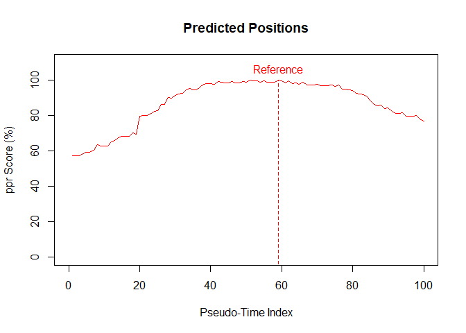

``` r

plot_position(samples_ppr[[1]],
              col = "darkgreen",
              overlay=FALSE,
              label = names(samples_ppr)[1])
plot_position(samples_ppr[[2]],
              col = "blue",
              overlay=TRUE,
              label = names(samples_ppr)[2])
```

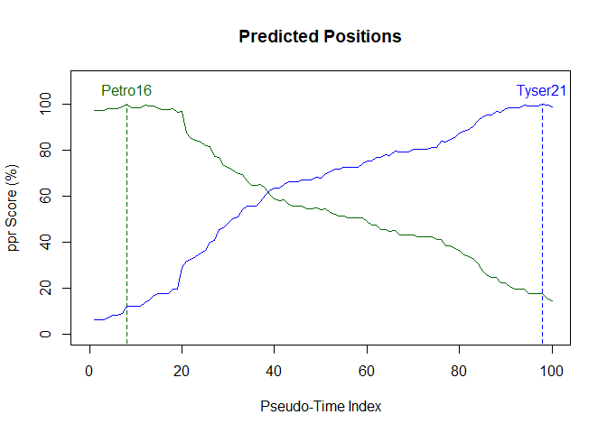

``` r
timeline_plot(switching_genes = switching_genes,
              genomic_expression_traces = TRUE,
              reduced_sce = samples_reduced[[1]],
              cell_id = 100)
```

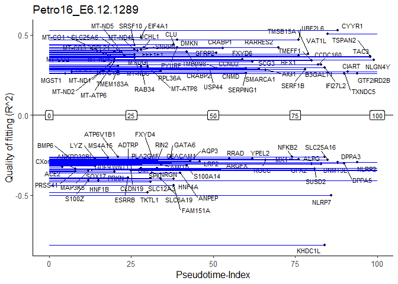

### Precision

##### Estimate the precision of PPR by running accuracy_test at a range of values

###### BUG!

``` r
precision(sce, r2_cutoff_range = seq(0.255, 0.263, 0.0001))
#> 1   0.255  done 
#> 2   0.2551  done 
#> 3   0.2552  done 
#> 4   0.2553  done 
#> 5   0.2554  done 
#> 6   0.2555  done 
#> 7   0.2556  done 
#> 8   0.2557  done 
#> 9   0.2558  done 
#> 10   0.2559  done 
#> 11   0.256  done 
#> 12   0.2561  done 
#> 13   0.2562  done 
#> 14   0.2563  done 
#> 15   0.2564  done 
#> 16   0.2565  done 
#> 17   0.2566  done 
#> 18   0.2567  done 
#> 19   0.2568  done 
#> 20   0.2569  done 
#> 21   0.257  done 
#> 22   0.2571  done 
#> 23   0.2572  done 
#> 24   0.2573  done 
#> 25   0.2574  done 
#> 26   0.2575  done 
#> 27   0.2576  done 
#> 28   0.2577  done 
#> 29   0.2578  done 
#> 30   0.2579  done 
#> 31   0.258  done 
#> 32   0.2581  done 
#> 33   0.2582  done 
#> 34   0.2583  done 
#> 35   0.2584  done 
#> 36   0.2585  done 
#> 37   0.2586  done 
#> 38   0.2587  done 
#> 39   0.2588  done 
#> 40   0.2589  done 
#> 41   0.259  done 
#> 42   0.2591  done 
#> 43   0.2592  done 
#> 44   0.2593  done 
#> 45   0.2594  done 
#> 46   0.2595  done 
#> 47   0.2596  done 
#> 48   0.2597  done 
#> 49   0.2598  done 
#> 50   0.2599  done 
#> 51   0.26  done 
#> 52   0.2601  done 
#> 53   0.2602  done 
#> 54   0.2603  done 
#> 55   0.2604  done 
#> 56   0.2605  done 
#> 57   0.2606  done 
#> 58   0.2607  done 
#> 59   0.2608  done 
#> 60   0.2609  done 
#> 61   0.261  done 
#> 62   0.2611  done 
#> 63   0.2612  done 
#> 64   0.2613  done 
#> 65   0.2614  done 
#> 66   0.2615  done 
#> 67   0.2616  done 
#> 68   0.2617  done 
#> 69   0.2618  done 
#> 70   0.2619  done 
#> 71   0.262  done 
#> 72   0.2621  done 
#> 73   0.2622  done 
#> 74   0.2623  done 
#> 75   0.2624  done 
#> 76   0.2625  done 
#> 77   0.2626  done 
#> 78   0.2627  done 
#> 79   0.2628  done 
#> 80   0.2629  done 
#> 81   0.263  done
abline(v = 0.257, col = "blue")
```

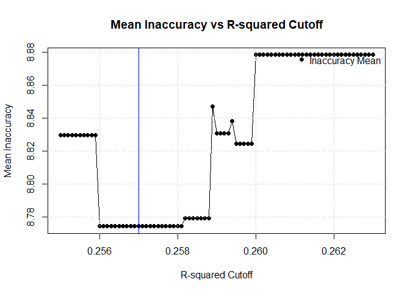

``` r
#more accuracy investigation:
ref_acc <- accuracy_test(reference_ppr, sce, plot = FALSE)

#
plot(ref_acc$true_timeIDX, ref_acc$inaccuracy,
     xlab = "True Position",
     ylab = "Inaccuracy",
     main = "Inaccuracy by True Positions")
```


``` r

#
boxplot(ref_acc$inaccuracy ~ ref_acc$true_timeIDX,
        xlab = "True Position",
        ylab = "Inaccuracy",
        main = "Boxplots of Inaccuracy by True Positions")
```

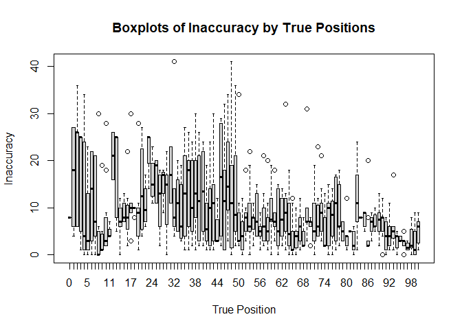

``` r

true_position_bin <- cut(ref_acc$true_timeIDX,
                         breaks = c(0,
                                    5,
                                    10,
                                    15,
                                    20,
                                    25,
                                    30,
                                    35,
                                    40,
                                    45,
                                    50,
                                    55,
                                    60,
                                    65,
                                    70,
                                    75,
                                    80,
                                    85,
                                    90,
                                    95,
                                    100))

boxplot(ref_acc$inaccuracy ~ true_position_bin,
        xlab = "True Position",
        ylab = "Inaccuracy",
        main = "Boxplots of Inaccuracy by True Positions")
```

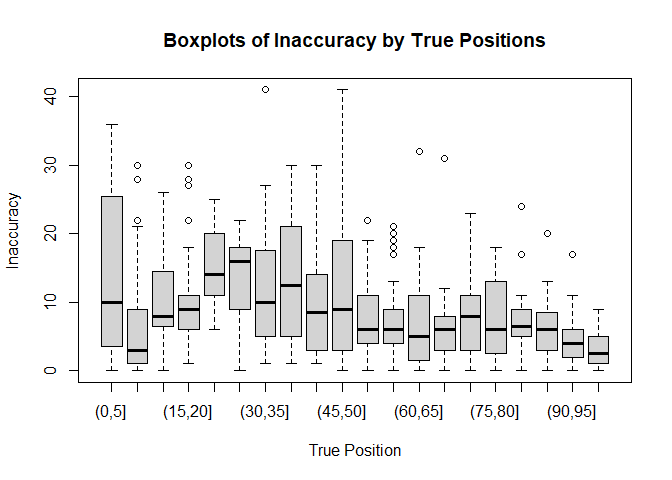

``` r

#
plot(x = ref_acc$true_timeIDX, y = ref_acc$predicted_timeIDX,
     xlab = "True Position",
     ylab = "Predicted Position",
     main = "Predicted Positions by True Positions")
```

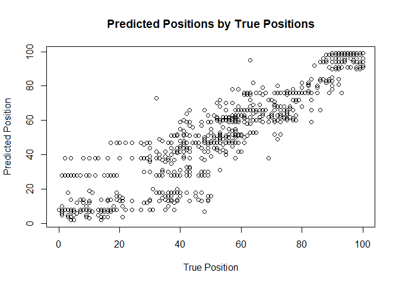

``` r


#
boxplot(ref_acc$predicted_timeIDX ~ ref_acc$true_timeIDX,
        xlab = "True Position",
        ylab = "Predicted Position",
        main = "Boxplots of Predicted Positions by True Positions")
```

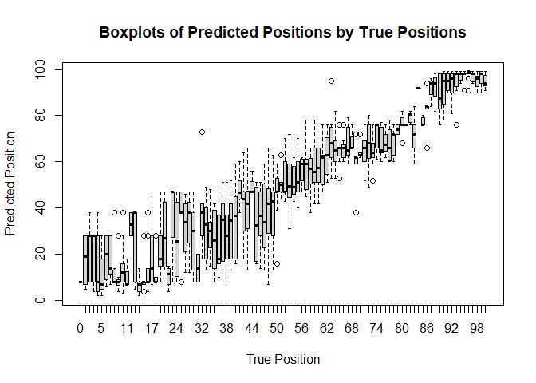
