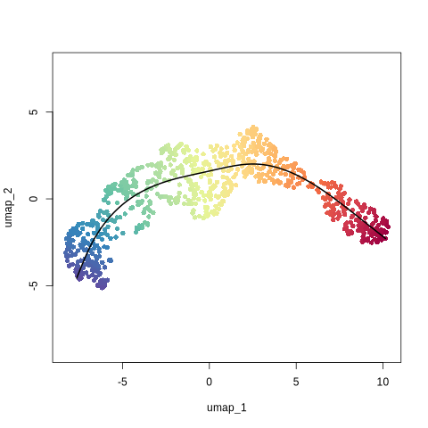
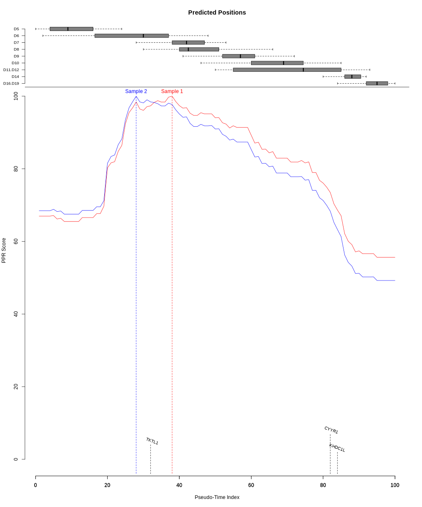
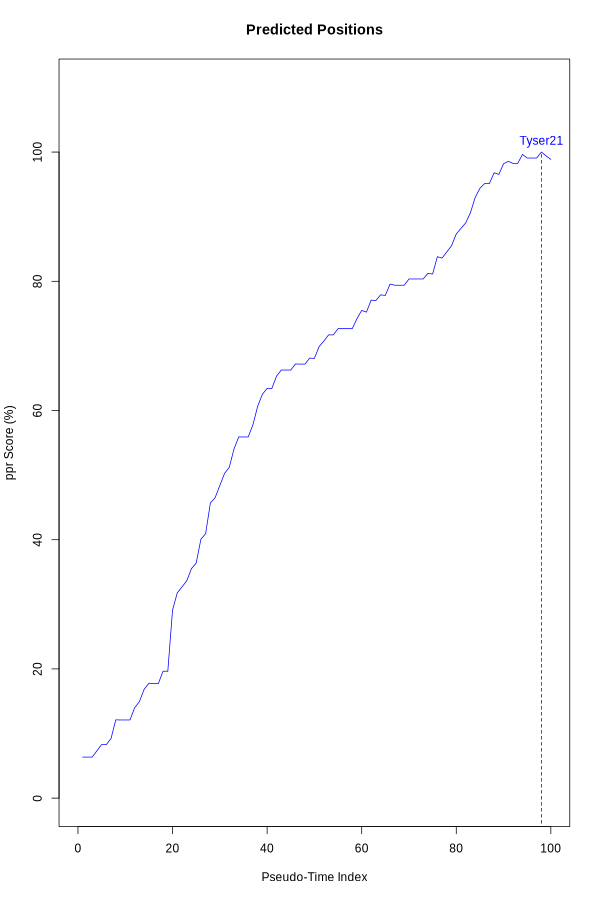

<!-- README.md is generated from README.Rmd. Please edit that file -->

# PathPinpointR

<!-- badges: start -->
<!-- badges: end -->

PathPinpointR identifies the position of a sample upon a trajectory.

##### *Assumptions:*

-   Sample is found upon the chosen trajectory.
-   Sample is from a distinct part of the trajectory. A sample with
    cells that are evenly distributed across the trajectory will have a
    predicted location of the centre of the trajectory.

# Example Workflow

This vignette will take you through the basics running PPR. The data
used here is an integrated data-set of blastocyst data.

## Installation

#### Check and install required packages

Run the following code to load all packages neccecary for PPR & this
vignette.

    required_packages <- c("SingleCellExperiment", "Biobase", "fastglm", "ggplot2",
                           "monocle", "plyr", "RColorBrewer", "ggrepel", "ggridges",
                           "gridExtra", "devtools", "mixtools", "Seurat",
                           "parallel", "RColorBrewer")

    ## for package "fastglm", "ggplot2", "plyr", "RColorBrewer",
    # "ggrepel", "ggridges", "gridExtra", "mixtools"
    new_packages <- required_packages[!(required_packages %in% installed.packages()[,"Package"])]
    if(length(new_packages)) install.packages(new_packages)

    ## for package "SingleCellExperiment", "Biobase", "slingshot".
    if (!requireNamespace("BiocManager", quietly = TRUE)) install.packages("BiocManager")
    new_packages <- required_packages[!(required_packages %in% installed.packages()[,"Package"])]
    if(length(new_packages)) BiocManager::install(new_packages)

    devtools::install_github("SGDDNB/GeneSwitches")

#### install PathPinpointR

You can install the development version of PathPinpointR using:

    devtools::install_github("moi-taiga/PathPinpointR")

### Load the required packages

    library(PathPinpointR)
    library(Seurat)
    library(ggplot2)
    library(SingleCellExperiment)
    library(slingshot)
    library(RColorBrewer)
    library(GeneSwitches)

## Load the reference data

The reference dataset is a Seurat object of a blastocyst dataset.

    # download the example data
    get_example_data()

    # Load the reference data to the environment
    seu <- readRDS("./reference.rds")

#### View the reference UMAP plot

From the plot we can see that the data shows a clear trajectory. Tyser21
is the study with the most developed cells, while Petro16 has the least.

    DimPlot(object = seu,
            reduction = "umap",
            group.by = "orig.ident",
            label = TRUE) +
      ggtitle("Reference")

## Use subsets of the Reprogramming data-set as queries.

As a proxy for an input sample, we can use subsets of the reference
data-set. Here we use Petro16 and Tyser21, the most distant samples on
the trajectory.

    ## Take two subsets of the reference to use as samples
    sample_names <- c("Petro16", "Tyser21")

    # Make an empty list to store the samples
    samples_seu <- list()
    # Iterate through each sample name, make a list of subsets.
    for (sample in sample_names){
      sample_seu <- subset(x = seu, subset = orig.ident %in% sample)
      samples_seu[[sample]] <- sample_seu
    }

## Convert to SingleCellExperiment objects.

Prior to running slingshot and GeneSwitches, we need to convert the
Seurat objects to SingleCellExperiment objects.

    sce    <- SingleCellExperiment(assays = list(expdata = seu@assays$RNA$counts))
    colData(sce) <- DataFrame(seu@meta.data)
    reducedDims(sce)$UMAP <- seu@reductions$umap@cell.embeddings

    # create an empty list to to store the sce objects
    samples_sce <- list()

    #
    for (sample_name in names(samples_seu)){
      sample_seu <- samples_seu[[sample_name]]
      # convert each sample to a SingleCellExperiment object
      sample_sce <- SingleCellExperiment(assays = list(expdata = sample_seu@assays$RNA$counts))
      # Store the result in the new list
      samples_sce[[sample_name]] <- sample_sce
    }

## Run slingshot

Run slingshot on the reference data to produce pseudotime for each cell,
within the trajectory of blastocyst development.

    sce  <- slingshot(sce,
                      clusterLabels = "seurat_clusters",
                      start.clus  = "2",
                      end.clus = "1",
                      reducedDim = "UMAP")

    #Rename the Pseudotime column to work with GeneSwitches
    colData(sce)$Pseudotime <- sce$slingPseudotime_1

#### Plot the slingshot trajectory.

The plot shows the trajectory of the blastocyst data, with cells colored
by pseudotime.

    # Generate colors
    colors <- colorRampPalette(brewer.pal(11, "Spectral")[-6])(100)
    plotcol <- colors[cut(sce$slingPseudotime_1, breaks = 100)]
    # Plot the data
    plot(reducedDims(sce)$UMAP, col = plotcol, pch = 16, asp = 1)
    lines(SlingshotDataSet(sce), lwd = 2, col = "black")

## Binarize the Gene Expression Data

Using the package
[GeneSwitches](https://github.com/SGDDNB/GeneSwitches), binarize the
gene expression data of the reference and query data-sets, with a cutoff
of 1.

    # binarize the expression data of sce
    sce           <- binarize_exp(sce,
                                  fix_cutoff = TRUE,
                                  binarize_cutoff = 1,
                                  ncores = 4)

    # Define a list to store the binarized samples
    samples_binarized <- list()
    # Iterate through each Seurat object in the list and binarize.
    for (sample_name in names(samples_sce)){
      sample_sce <- samples_sce[[sample_name]]
      # binarize the expression data of the sample
      sample_binarized <- binarize_exp(sample_sce,
                                       fix_cutoff = TRUE,
                                       binarize_cutoff = 1,
                                       ncores = 4)
      # Store the result in the new list
      samples_binarized[[sample_name]] <- sample_binarized
    }
    # Find the swithcing point of each gene in the reference data
    sce <- find_switch_logistic_fastglm(sce,
                                        downsample = TRUE,
                                        show_warning = FALSE)

Note: both binatize\_exp() and find\_switch\_logistic\_fastglm(), are
time consuming processes and may take tens of minutes, or hours, to run.

# **remove this chunk after testing**

#### *(it is only here to save time)*

###### Load binarized data

    sample_names <- c("Petro16", "Tyser21")
    #,"Mole21a","Mole21b","Sozen21","Xiang20", "Yanag21", "Zhou19")

    samples_binarized <- list()
    for (sample in sample_names){
      samples_binarized[[sample]] <- readRDS(paste0("../data/binarized_",
                                                    sample,
                                                    "_sce.rds"))
    }
    sce <- readRDS("../data/switches_gastglm_blastocyst_reference_sce.rds")

## Produce a matrix of switching genes

The switching genes change their expression pattern along the
trajectory.

First identify an optimum number of switching genes to include. Using
the PPR function precision():

    precision(sce)

Narrow down your search or you wont find the optimum number of switching
genes.

    precision(sce, n_sg_range = seq(75, 135, 1))

    switching_genes <- filter_switchgenes(sce,
                                          allgenes = TRUE,
                                          r2cutoff = 0,
                                          topnum = 133)

Note: The number of switching genes significantly affects the accuracy
of PPR.  
too many will reduce the accuracy by including uninformative
genes/noise.  
too few will reduce the accuracy by excluding informative genes.  
The using precision() we have found 133 to be the optimum, for this
data.  

## Visualise the switching genes

    # Plot the timeline using plot_timeline_ggplot
    plot_timeline_ggplot(switching_genes,
                         timedata = colData(sce)$Pseudotime,
                         txtsize = 3)

## Reduce the binarized counts matrices

As the first step of running PathPinpointR reduce the binarized counts
matrices, to only include the selection of switching genes.

    # filter the binary counts matricies to only include the switching genes
    reference_reduced <- subset_switching_genes(sce, switching_genes)

    # Define a list to store the results
    samples_reduced <- list()

    # Iterate through each Seurat object in the list
    for (sample_name in names(samples_binarized)){
      sample_binarized <- samples_binarized[[sample_name]]
      # susbet each sample to only include the switching genes
      sample_reduced <- subset_switching_genes(sample_binarized, switching_genes)
      # Store the result in the new list
      samples_reduced[[sample_name]] <- sample_reduced
    }

## Predict Position

Produce an estimate for the position of each cell in each sample. The
prediction is stored as a PPR\_OBJECT.

    reference_ppr <- predict_position(reference_reduced, switching_genes)

    # Define a list to store the ppr objects of the samples
    samples_ppr <- list()
    # Iterate through each Seurat object in the predicting their positons,
    # on the reference trajectory, using PathPinpointR
    for (sample_name in names(samples_reduced)){
      sample_reduced <- samples_reduced[[sample_name]]
      # predict the position of each gene in each cell of the sample
      sample_ppr <- predict_position(sample_reduced, switching_genes)
      #calculate zscore_and_pvalue
      # sample_ppr <- zscore_and_pvalue(sce = samples_reduced[[sample_name]],
      #                                 ppr = sample_ppr,
      #                                 switching_genes,
      #                                 cpu = 4)
      # Store the result in the new list
      samples_ppr[[sample_name]] <- sample_ppr
    }

## Measure accuracy

As our samples are subsets of the reference data-set, we can calculate
the accuracy of the prediction by, comparing each predicted position to
their pseudotimes, as defined by slingshot.

The accuracy varies across the range of pseudotimes, generally cells at
the centre of the trajectory are more accurately predicted.

    accuracy_test(reference_ppr, sce, plot = TRUE)

## Plotting the predicted position of each sample:

    plot_position(samples_ppr[[1]],
                  col = "darkgreen",
                  overlay = FALSE,
                  label = names(samples_ppr)[1])

    plot_position(samples_ppr[[2]],
                  col = "blue",
                  overlay = TRUE,
                  label = names(samples_ppr)[2])

## View the Standard Deviation and Z-Score of the predicted positions

As the predicted position is a probablility distribution, we can view
the standard deviation of each samples prediction.

We can also calcuate a z-score and P-Value of each sample’s predicted
position. This is done through comparing the distribution of the
predicted position, to the distribution of 2000 random samples.

    samples_ppr[[1]]$sd
    # 5.813048
    samples_ppr[[1]]$z_score
    # 12.76796
    samples_ppr[[1]]$p_value
    # "<0.0005"
