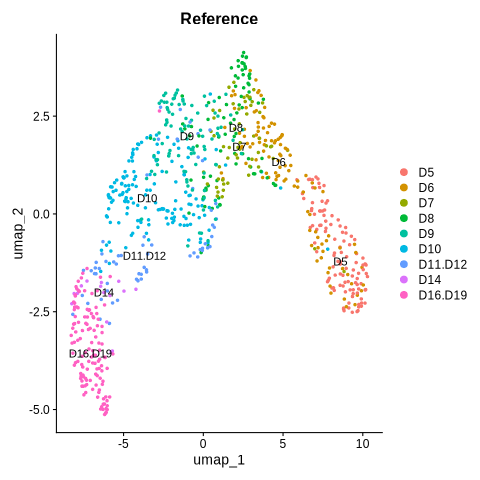
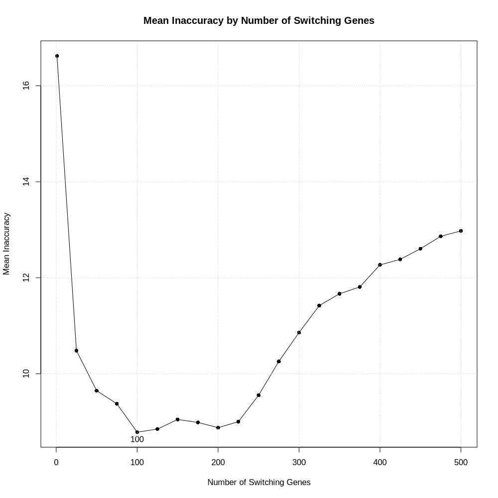
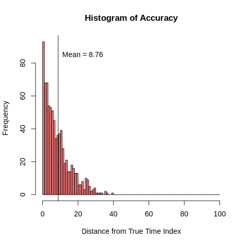

<!-- README.md is generated from README.Rmd. Please edit that file -->

```{r, include = FALSE}
knitr::opts_chunk$set(
  collapse = TRUE,
  comment = "#>",
  fig.path = "man/figures/README-",
  out.width = "100%",
  echo = TRUE,
  eval = FALSE
)
```

# PathPinpointR

<!-- badges: start -->

<!-- badges: end -->

PathPinpointR identifies the position of a sample upon a trajectory.

##### *Assumptions:*
-   Sample is found upon the chosen trajectory.
-   Sample is from a distinct part of the trajectory. A sample with cells that are evenly distributed across the trajectory will have a predicted location of the centre of the trajectory.


# Example Workflow

This vignette will take you through the basics running PPR.
The data used here is from the slingshot example data.

## Installation

#### Check and install required packages
Run the following code to load all packages neccecary for PPR & this vignette.
```{r}
required_packages <- c("SingleCellExperiment", "Biobase", "fastglm", "ggplot2",
                       "monocle", "plyr", "RColorBrewer", "ggrepel", "ggridges",
                       "gridExtra", "devtools", "mixtools", "Seurat",
                       "parallel", "RColorBrewer")

## for package "fastglm", "ggplot2", "plyr", "RColorBrewer",
# "ggrepel", "ggridges", "gridExtra", "mixtools"
new_packages <- required_packages[!(required_packages %in% installed.packages()[,"Package"])]
if(length(new_packages)) install.packages(new_packages)

## for package "SingleCellExperiment", "Biobase", "slingshot".
if (!requireNamespace("BiocManager", quietly = TRUE)) install.packages("BiocManager")
new_packages <- required_packages[!(required_packages %in% installed.packages()[,"Package"])]
if(length(new_packages)) BiocManager::install(new_packages)

devtools::install_github("SGDDNB/GeneSwitches")
```


#### install PathPinpointR
You can install the development version of PathPinpointR using:
```{r}
devtools::install_github("moi-taiga/PathPinpointR")
```

### Load the required packages
```{r}
#library(PathPinpointR)
library(Seurat)
library(ggplot2)
library(SingleCellExperiment)
library(slingshot)
library(RColorBrewer)
library(GeneSwitches)
```

## Load the reference data
The reference dataset is a Seurat object of a blastocyst dataset.
The data is an integrated dataset of 8 studies.
The data has been downsampled and filtered to only inlcude ebiblast cells.
```{r}
# genertate the example data

```

#### View the reference UMAP plot
Plot the reference data, colored by the day of development.
```{r}
DimPlot(object = reference_seu,
        reduction = "umap",
        group.by = "time",
        label = TRUE) +
  ggtitle("Reference")
```
```{r, eval = TRUE, echo = FALSE}
# Needs UPDATE
#
```
The plot shows the development of the epiblast cells.
Some labels are a mix of samples from differnt days.

## Convert to SingleCellExperiment objects.
Prior to running slingshot and GeneSwitches, 
we need to convert the Seurat objects to SingleCellExperiment objects.
```{r}
reference_sce    <- SingleCellExperiment(assays = list(expdata = reference_seu@assays$RNA$counts))
colData(reference_sce) <- DataFrame(reference_seu@meta.data)
reducedDims(reference_sce)$UMAP <- reference_seu@reductions$umap@cell.embeddings

# create an empty list to to store the sce sample objects
samples_sce <- list()
# Iterate through each Seurat object in the samples list
for (i in seq_along(samples_seu)){
  # convert each sample to a SingleCellExperiment object & store in the list
  samples_sce[[i]] <- SingleCellExperiment(assays = list(expdata = samples_seu[[i]]@assays$RNA$counts))
}
```

## Run slingshot 
Run slingshot on the reference data to produce pseudotime for each cell,
within the trajectory of blastocyst development.
```{r}
reference_sce  <- slingshot(reference_sce,
                            clusterLabels = "seurat_clusters",
                            start.clus  = "2",
                            end.clus = "1",
                            reducedDim = "UMAP")

#Rename the Pseudotime column to work with GeneSwitches
colData(reference_sce)$Pseudotime <- reference_sce$slingPseudotime_1
```

#### Plot the slingshot trajectory.
The plot shows the trajectory of the blastocyst data,
with cells colored by pseudotime.
```{r}
# Generate colors
colors <- colorRampPalette(brewer.pal(11, "Spectral")[-6])(100)
plotcol <- colors[cut(reference_sce$slingPseudotime_1, breaks = 100)]
# Plot the data
plot(reducedDims(reference_sce)$UMAP, col = plotcol, pch = 16, asp = 1)
lines(SlingshotDataSet(reference_sce), lwd = 2, col = "black")
```

```{r, eval = TRUE, echo = FALSE}
knitr::include_graphics("./man/figures/README-slingshot.png")
```


## Binarize the Gene Expression Data
Using the package [GeneSwitches](https://github.com/SGDDNB/GeneSwitches),
binarize the gene expression data of the reference and query data-sets,
with a cutoff of 1.
```{r, eval=FALSE}
# #start timer 
# start_time <- Sys.time()

# binarize the expression data of the reference
reference_sce <- binarize_exp(reference_sce,
                              fix_cutoff = TRUE,
                              binarize_cutoff = 1,
                              ncores = 8)

# binarize the expression data of the samples
samples_binarized <- lapply(samples_sce,
                            binarize_exp,
                            fix_cutoff = TRUE,
                            binarize_cutoff = 1,
                            ncores = 8)

# Find the switching point of each gene in the reference data
reference_sce <- find_switch_logistic_fastglm(reference_sce,
                                              downsample = TRUE,
                                              show_warning = FALSE)

# # end timer
# end_time <- Sys.time()
# end_time - start_time

```
Note: both binatize_exp() and find_switch_logistic_fastglm(),
are time consuming processes and may take tens of minutes, or hours, to run.


# **remove this chunk after testing** 
#### *(it is only here to save time)*
###### Load binarized data
```{r, echo = TRUE}
# sample_names <- c("Petro16", "Tyser21")
# #,"Mole21a","Mole21b","Sozen21","Xiang20", "Yanag21", "Zhou19")

# samples_binarized <- list()
# for (sample in sample_names){
#   samples_binarized[[sample]] <- readRDS(paste0("../data/binarized_",
#                                                 sample,
#                                                 "_sce.rds"))
# }

library(Seurat)
library(ggplot2)
library(SingleCellExperiment)
library(slingshot)
library(RColorBrewer)
library(GeneSwitches)
library(devtools)
load_all()

reference_sce <- readRDS("../data/README_sce_log_bin.rds")

###
sample_names <- c("LW120", "LW122")
samples_binarized <- list()
for (sample_name in sample_names){
  samples_binarized[[sample_name]] <- readRDS(paste0("/mainfs/ddnb/PathPinpointR/package/data/additional_blastocyst/binarized_", sample_name, "_sce.rds"))
}
```

## Produce a matrix of switching genes
The switching genes change their expression pattern along the trajectory.

First identify an optimum number of switching genes to include. 
Using the PPR function precision():
```{r}
precision(reference_sce)
```

```{r, eval = TRUE, echo = FALSE}

```

Narrow down your search or you wont find the optimum number of switching genes.
```{r}
precision(reference_sce, n_sg_range = seq(1, 250, 1))
```

```{r, eval = TRUE, echo = FALSE}
knitr::include_graphics("./man/figures/README-precision2_plot.png")
```


```{r}
switching_genes <- filter_switchgenes(reference_sce,
                                      allgenes = TRUE,
                                      r2cutoff = 0,
                                      topnum = 114)
```
Note: The number of switching genes significantly affects the accuracy of PPR.\
  too many will reduce the accuracy by including uninformative genes/noise. \
  too few will reduce the accuracy by excluding informative genes. \
The using precision() we have found 114 to be the optimum, for this data. \


## Visualise the switching genes
```{r}
# Plot the timeline using plot_timeline_ggplot
plot_timeline_ggplot(switching_genes,
                     timedata = colData(reference_sce)$Pseudotime,
                     txtsize = 3)

```

```{r, eval = TRUE, echo = FALSE}
knitr::include_graphics("./man/figures/README-switching-genes.png")
```


## Reduce the binarized counts matrices 
As the first step of running PathPinpointR reduce the binarized counts matrices,
to only include the selection of switching genes.
```{r}
# filter the binary counts matricies to only include the switching genes
reference_reduced <- subset_switching_genes(reference_sce, switching_genes)

# Susbet each sample to only include the switching genes
samples_reduced <- lapply(samples_binarized,
                          subset_switching_genes,
                          switching_genes)

```

## Predict Position
Produce an estimate for the position of each cell in each sample.
The prediction is stored as a PPR_OBJECT.
```{r}
reference_ppr <- predict_position(reference_reduced, switching_genes)

# Iterate through each Seurat object in the predicting their positons,
# on the reference trajectory, using PathPinpointR.
samples_ppr <- lapply(samples_reduced, predict_position, switching_genes)
```

## Measure accuracy
As our samples are subsets of the reference data-set,
we can calculate the accuracy of the prediction by,
comparing each predicted position to their pseudotimes, as defined by slingshot.

The accuracy varies across the range of pseudotimes, 
generally cells at the centre of the trajectory are more accurately predicted.

```{r}
accuracy_test(reference_ppr, reference_sce, plot = TRUE)
```

```{r, eval = TRUE, echo = FALSE}

```

## Plotting the predicted position of each sample:

```{r}
# Run the code
ppr_plot() +
  reference_idents(reference_sce, "time") +
  sample_prediction(samples_ppr[[1]], label = "red", col = "red")

sample_prediction(samples_ppr[[2]], label = "blue", col = "blue")

switching_times(c("TKTL1", "CYYR1", "KHDC1L"), switching_genes)

```

```{r eval = TRUE, echo = FALSE}
######## UPDATE
#knitr::include_graphics("./man/figures/README-sample1.png")
```

```{r, eval = TRUE, echo = FALSE}

## UPDATE
#knitr::include_graphics("./man/figures/README-sample2.png")
```


