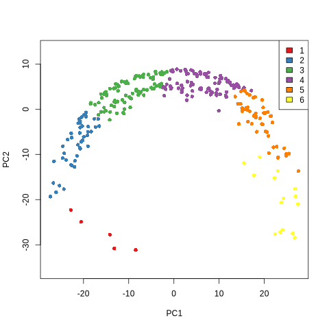

<!-- README.md is generated from README.Rmd. Please edit that file -->

# PathPinpointR

PathPinpointR identifies the position of a sample upon a trajectory.

##### *Assumptions:*

-   Sample is found upon the chosen trajectory.
-   Sample is from a distinct part of the trajectory. A sample with
    cells that are evenly distributed across the trajectory will have a
    predicted location at the centre of the trajectory.

# Example Workflow

This vignette will take you through the basics running PPR. The data
used here is generated in a similar fashion to the [Slingshot
vignette](https://bioconductor.org/packages/devel/bioc/vignettes/slingshot/inst/doc/vignette.html).

## Installation

#### Install required packages

Run the following code to load all packages necessary for PPR & this
vignette.

    required_packages <- c("SingleCellExperiment", "Biobase", "fastglm", "ggplot2",
                           "monocle", "plyr", "RColorBrewer", "ggrepel", "ggridges",
                           "gridExtra", "devtools", "mixtools", "Seurat",
                           "parallel", "RColorBrewer", "mclust")

    ## for packages "fastglm", "ggplot2", "plyr", "RColorBrewer",
    # "ggrepel", "ggridges", "gridExtra", "mixtools"
    new_packages <- required_packages[!(required_packages %in% installed.packages()[,"Package"])]
    if(length(new_packages)) install.packages(new_packages)

    ## for packages "SingleCellExperiment", "Biobase", "slingshot".
    if (!requireNamespace("BiocManager", quietly = TRUE)) install.packages("BiocManager")
    new_packages <- required_packages[!(required_packages %in% installed.packages()[,"Package"])]
    if(length(new_packages)) BiocManager::install(new_packages)

    # for package "GeneSwitches"
    devtools::install_github("SGDDNB/GeneSwitches")

#### install PathPinpointR

You can install the development version of PathPinpointR using:

    devtools::install_github("UoSDDNB/PathPinpointR")

### Load the required packages

    library(PathPinpointR)
    library(Seurat)
    library(ggplot2)
    library(SingleCellExperiment)
    library(slingshot)
    library(RColorBrewer)
    library(GeneSwitches)
    library(mclust)

## Generate the data

The data for this vignette is generated in a similar fasion to the
[Slingshot
vignette](https://bioconductor.org/packages/devel/bioc/vignettes/slingshot/inst/doc/vignette.html).
A subset of the reference data is used as a proxy for the sample data.

    ### Genertate the reference data (can take a few minutes)
    reference_sce <- get_synthetic_data()
    # Generate the sample data by subsetting the reference data
    # in one sample inlcude c20-c45, in the other c220-c240.
    samples_sce <- list(reference_sce[,c(20:45)], reference_sce[,c(220:240)]) 
    # name the samples
    names(samples_sce) <- c("Early", "Late")

The synthetic data is generated by simulating a trajectory with 300
cells, where gene expression values are modeled as combinations of
non-differentially expressed genes and genes showing activation or
deactivation patterns along the trajectory. These patterns are defined
using mathematical functions (e.g., atan) to simulate gradual changes in
expression. Sample data is created by subsetting the synthetic
trajectory into distinct regions, with one sample containing cells from
an early-to-mid stage (e.g., cells 20–45) and the other from a later
stage (e.g., cells 220–240). This setup mimics biological scenarios with
distinct developmental stages or conditions.

#### View the PCA plot from the reference data

    # Plot the reference data, colored by cluster.
    plot(reducedDims(reference_sce)$PCA,
                     col = brewer.pal(9,"Set1")[colData(reference_sce)$GMM],
                     pch=16, asp = 1)
    # add a legend
    legend("topright",
           legend = levels(colData(reference_sce)$clust_names),
           fill = brewer.pal(9,"Set1"))

The plot shows the development of the cells, through the clusters.

## Run slingshot

Run slingshot on the reference data to produce pseudotime for each cell.

    # Slingshot
    reference_sce <- slingshot(reference_sce,
                     clusterLabels = 'GMM',
                     reducedDim = 'PCA')

    #Rename the Pseudotime column to work with GeneSwitches
    colData(reference_sce)$Pseudotime <- reference_sce$slingPseudotime_1

#### Plot the slingshot trajectory.

    # Generate colors
    colors <- colorRampPalette(brewer.pal(11, "Spectral")[-6])(100)
    plotcol <- colors[cut(reference_sce$slingPseudotime_1, breaks = 100)]
    # Plot the data
    plot(reducedDims(reference_sce)$PCA, col = plotcol, pch=16, asp = 1)
    lines(SlingshotDataSet(reference_sce), lwd = 2, col = "black")

 The plot
shows the trajectory of the reference data, with cells colored by
pseudotime.

## Binarize the reference Expression Data

Using the package
[GeneSwitches](https://github.com/SGDDNB/GeneSwitches), binarize the
gene expression data of the reference data.

    # binarize the expression data of the reference
    reference_sce <- binarize_exp(reference_sce,
                                  fix_cutoff = TRUE,
                                  binarize_cutoff = 0.4,
                                  ncores = 1)

    # Find the switching point of each gene in the reference data
    reference_sce <- find_switch_logistic_fastglm(reference_sce,
                                                  downsample = TRUE,
                                                  show_warning = FALSE)

Note: both binarize\_exp() and find\_switch\_logistic\_fastglm() are
time consuming processes and may take tens of minutes to run.

## Visualise the switching genes

generate a list of switching genes, and visualise them on a pseudo
timeline.

    switching_genes <- filter_switchgenes(reference_sce,
                                          allgenes = TRUE,
                                          r2cutoff = 0)

    # Plot the timeline using plot_timeline_ggplot
    plot_timeline_ggplot(switching_genes,
                         timedata = colData(reference_sce)$Pseudotime,
                         txtsize = 3)

 The
distribution of the switching genes along the trajectory is shown.  
Due to the nature of this syntheic data the switching gnenes are not
evenly distributed.  
Note: The number of switching genes significantly affects the accuracy
of PPR.  
too many will reduce the accuracy by including uninformative
genes/noise.  
too few will reduce the accuracy by excluding informative genes.  

## Select a number of switching genes

Using the PPR function precision() an optimum number of switching genes
can be found.

    precision(reference_sce, n_sg_range = seq(0, 800, 25))

Narrow down the search to find the optimum number of switching genes.

    precision(reference_sce, n_sg_range = seq(722, 822,2))

## Produce a filtered matrix of switching genes

The using precision(), 772 is found to be the optimum for this data.  
When using true biological data, the optimum number is likely to be
lower.  

    switching_genes <- filter_switchgenes(reference_sce,
                                          allgenes = TRUE,
                                          r2cutoff = 0,
                                          topnum = 772)

## Visualise the filtered switching genes

    # Plot the timeline using plot_timeline_ggplot
    plot_timeline_ggplot(switching_genes,
                         timedata = colData(reference_sce)$Pseudotime,
                         txtsize = 3)

 the
least informative genes have been removed from the timeline. the number
of uninformative genes would be greater with biological data. the
accuracy can be visualised using `acuracy_test`.

## Measure accuracy

We can calculate the accuracy of PPR in the given trajectory by
comparing the predicted position of the reference cells to their
pseudotimes defined by slingshot.

    # predict the position of cells in the reference trajectory.
    reference_ppr <- predict_position(reference_sce, switching_genes)

    # plot the accuracy of the prediction
    accuracy_test(reference_ppr, reference_sce, plot = TRUE)

## Binarize the sample data

Binarize the gene expression data of the samples.

    # First reduce the sample data to only include the switching genes.
    samples_sce <- lapply(samples_sce, reduce_counts_matrix, switching_genes)

    # binarize the expression data of the samples
    samples_binarized <- lapply(samples_sce,
                                binarize_exp,
                                fix_cutoff = TRUE,
                                binarize_cutoff = 1,
                                ncores = 1)

## Predict Position

Produce an estimate for the position of each cell in each sample. The
prediction is stored as a PPR\_OBJECT.

    # Iterate through each Seurat object in the predicting their positons,
    # on the reference trajectory, using PathPinpointR.
    samples_ppr <- lapply(samples_binarized, predict_position, switching_genes)

## Plotting the predicted position of each sample:

plot the predicted position of each sample on the reference trajectory.

    ppr_plot() +
      # show the predicted position of the first sample
      sample_prediction(samples_ppr[[1]], label = "Sample 1", col = "red") +
      # inlcude the position of cells in the reference data, by they cluster labels.
      reference_idents(reference_sce, "clust_names")

    # show the predicted position of the second sample
    sample_prediction(samples_ppr[[2]], label = "Sample 2", col = "blue")

    # show the points at which selected genes switch.
    switching_times(c("G1172", "G1346", "G901"), switching_genes)

A simpler plot of your results can be generated with the function
ppr\_vioplot().

    ppr_vioplot(samples_ppr, reference_sce, ident = "clust_names")

### Conclusion

By following this workflow, you will have:   - generated a synthetic
dataset, representing a developmental trajectory.  
- subset the data to generate two proxy samples.  
- run slingshot to produce pseudotime for each cell.  
- binarized the gene expression data of the reference data.  
- found the switching genes along the trajectory.  
- predicted the position of the sample data on the reference
trajectory.  
- measured the accuracy of the prediction.  
- visualised the predicted position of the samples on the reference
trajectory.  
